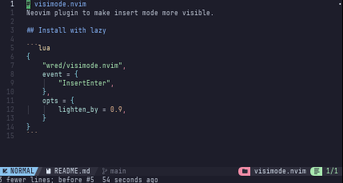

# visimode.nvim
Neovim plugin to make insert mode more visible.



## Install with lazy

```lua
{
    "wred/visimode.nvim",
    event = {
        "InsertEnter",
    },
    opts = {
	    lighten_by = 0.9,
    }
}
```
